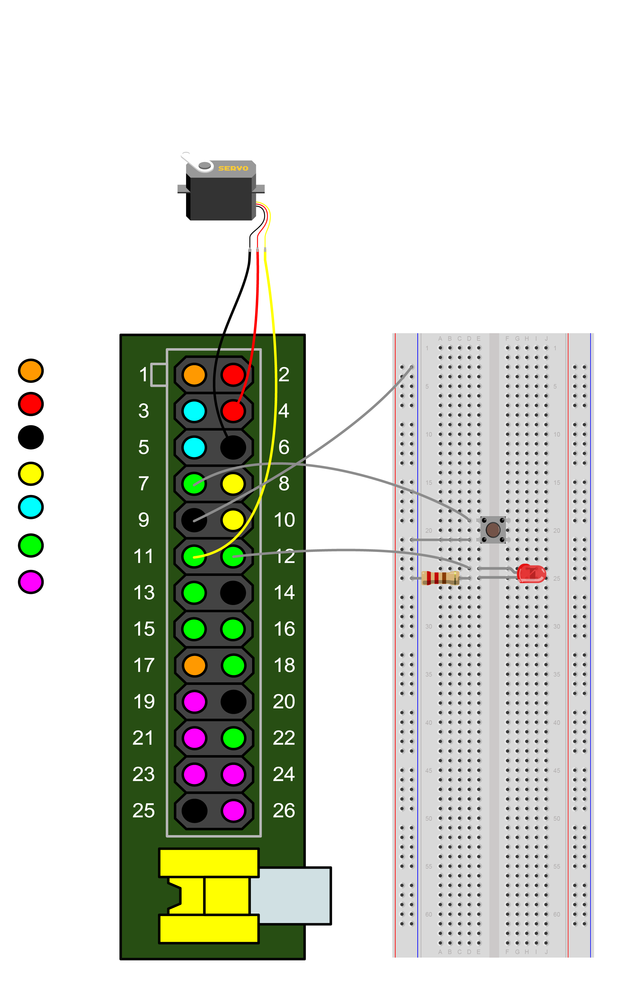

# CITS5506 Project

## Requirements

* A device that is capable of running `Miniconda` and `Flask` with a browser that supports [Notifications API](https://developer.mozilla.org/en-US/docs/Web/API/Notifications_API#browser_compatibility).
* A Raspberry Pi.
* The device and the Raspberry Pi must be connected to the same private network.
* A breadboard
* A servo motor
* A USB Microphone
* A speaker
* A pushbutton
* A Raspberry Pi camera
* Two female-to-male jumper wires
* Three male-to-male jumper wires

## Setup

### Smart Doorbell (Run on Raspberry Pi)

Connect Raspberry Pi to a camera through the camera serial interface, a speaker either via Bluetooth or an AUX cord. Then wire up the rest of the components on the Raspberry Pi breadboard as follows.



Find the private IP address of the Raspberry Pi.

```bash
hostname -I
```

Install `python-vlc`.

```bash
pip install python-vlc
```

Run the doorbell code providing the IP address of the device as the first commandline argument.

```bash
python doorbell.py device_ip_address
```

### User Interface (Run on any device)

Find the private IP address of the device. This is how to do it on a Unix operating system.

```bash
ifconfig | egrep 'inet .* broadcast' | cut -d' ' -f2
```

List all the virtual environments on your system.

```bash
conda env list
```

If you see the error messsage `command not found` go install [Miniconda](https://docs.conda.io/en/latest/miniconda.html).

Otherwise check the list of virtual environments on your system and make sure the name `iot` does not exist.

Then create a new virtual environment called `iot` with all the dependencies installed and activate it.

```bash
conda env create --file iot.yml
conda activate iot
```

If it already exists just use another name that is not taken.

```bash
mv iot.yml name_not_taken.yml
conda env create --file name_not_taken.yml
conda activate name_not_taken
```

Run the user code providing the IP address of the Raspberry Pi as the first commandline argument.

```bash
python user.py raspberry_pi_ip_address
```

Open <http://localhost:5000/> to view the user interface.
